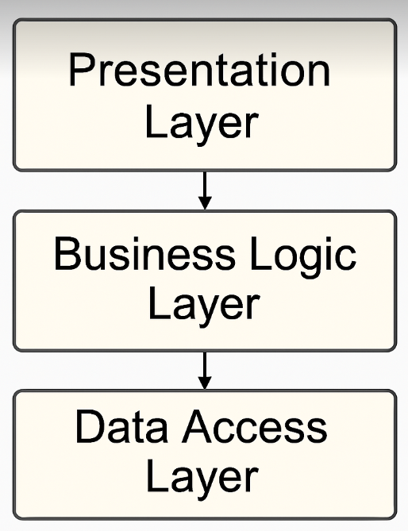

# Felhőalapú elosztott rendszerek laboratórium - 4-5.házi

>Készítették: Erőss Helga Enikő (ZCA6AF), Gódor Márton (UDRF04)

## PhotoAlbumApp
A PhotoAlbumApp egy ASP.NET Core MVC alapú webalkalmazás, amely lehetővé teszi a felhasználók számára a fotók feltöltését, megtekintését, valamint törlését. A felhasználónak lehetősége van regisztálni, bejelentkezni, kijelentkezni. A képet/képeket abban az esetben látja, ha be tud jelentkezni. A fényképek modal ablakban jelennek meg, és lehetőség van közöttük lépkedni. Az alkalmazás SQLite adatbázist használ, Dockerrel konténerizálva, és OpenShift-en is futtatható.

## Felhasznált technológiák
- **.NET 8:** A projekt ASP.NET Core MVC architektúrára épül, amely elválasztja az adatkezelést, megjelenítést és vezérlést.
- **Razor, ccs, Bootstrap:** A felhasználói felület megjelenítését és reszponzivitását biztosítják. Bootstrap biztosítja a modern dizájnt és interakciókat.
- **SQLite:** Fájl alapú relációs adatbázis a fotók és felhasználók tárolására.
- **Docker:** A projekt konténerizálása, az egyszerű fejlesztési és üzemeltetési környezet érdekében.
- **OpenShift:** Felhőalapú konténerkezelő platform, amely biztosítja az alkalmazás skálázható és megbízható üzemeltetését.

## Modellek
### Photo:
    - Id: a fotó azonosítója.
    - Name: a fotó neve.
    - UploadDate: a fotó feltöltésének ideje.
    - FilePath: a fotó elérési útvonala, ahonnan képes betölteni.
    - UderId: a fotót feltöltő felhasználó azonisítója.
### User:
    - Id: a felhasználó azonosítója.
    - Username: a felhasználó neve.
    - PasswordHash: a felhasználó bejelntkezéséhez szükséges jelszó.

## Funkciók
### Fotók:
- Új feltöltése
- Listázása kártyás nézetben
- Rendezés név vagy dátum szerint gomb segítségével
- Modal ablakos képnézegetés
- Nyilakkal lépkedés a képek között
- Fénykép törlése szemetes ikon segítségével, megerősítéssel

### Felhasználó:
- Regisztráció
- Bejelentkezés
- Kijelentkezés


## Háromrétegű Architektúra
Az alkalmazásunkat háromrétegű architektúra felhasználásával fejlesztettük, amely egy jól strukturált, áttekinthető és könnyen karbantartható megoldást eredményezett. Az első réteg a prezentációs réteg, amely a felhasználói felületet biztosítja, itt helyezkednek el a Razor-oldalak és a felhasználói interakciókat kezelő logika. A középső réteg az üzleti logikai réteg, amely az alkalmazás központi funkcióit, adatfeldolgozását, validációját, valamint a validációs szabályok betartását végzi. Ez a réteg felelős például a képek feltöltésével, rendezésével és kezelésével kapcsolatos feladatokért, így biztosítva, hogy a felhasználói műveletek megfelelően hajtódjanak végre. A harmadik réteg pedig az adat-hozzáférési réteg (DAL), amely az adatok perzisztens tárolásáért és adatbázis-műveletekért felelős. Itt definiáltuk a különböző adatmodelleket, például a felhasználók és képek tárolásához szükséges struktúrákat, illetve az adatbázis műveletek kezeléséhez használt Entity Framework Core kontextust. Az architektúra rétegeinek elválasztása révén az alkalmazás skálázhatósága javul, valamint könnyebbé vált az egyes rétegek önálló tesztelése és fejlesztése. 



# ASP.NET Razor alkalmazás hosztolása OpenShift Developer Sandbox-ban


## 1. Git alapú importálás OpenShift-ben

### Megoldás
- GitHub repository link megadása
- Builder image kiválasztása: `.NET 8`
- `.s2i/environment` fájl létrehozása a következő tartalommal: DOTNET_STARTUP_PROJECT=PhotoAlbumApp/PhotoAlbumApp.csproj

## 2. Build és futtatási hibák

### Hiba
- A build sikeres volt, de a `/photo/index` végpont 500-as hibát adott vissza
- Az SQLite adatbázis nem tartalmazta a szükséges táblákat

### Megoldás
- A `Program.cs` fájlban automatikus migrációt adtunk hozzá:

```csharp
using (var scope = app.Services.CreateScope())
{
    var db = scope.ServiceProvider.GetRequiredService<AppDbContext>();
    db.Database.Migrate();
}


